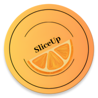

 

    
  </a>

  <h3 align="center">SliceUp - meal planning app</h3>

  

  Plan meals for the whole week. Save time, money and energy for someone or something you love.

  
Table of Contents

  <ol>
    <li>
      <a href="#about-the-project">About The Project</a>
    </li>
    <li><a href="#roadmap">Roadmap</a></li>
  </ol>

## About The Project

SliceUp is my new Android app for planning meals for the whole week.
The main idea is to simplify the whole process of planning your meals - from creating a base with your favorite recipes, planning what you are going to cook for the whole week of just weekends, and finally, building an entire list of groceries to save time for shopping. 

### Built With

* Kotlin
* Jetpack compose

## Roadmap
- [x] Created personas, a customer journey map  <a href="https://drive.google.com/file/d/1vrpAytPPcbJLOrA0djycPZ3BcT5bxnfE/view?usp=sharing">Link</a>
- [x] Created the UX prototype - <a href="https://www.figma.com/file/CCxIlRWLMe1mUQ1WplVj29/MealPrep_current?node-id=1-632">Link to Figma</a>
- [x] Created UI on Jetpack compose
- [ ] I am learning about working with Data in Android
- [ ] MVVM, Repository, Clean Architecture patterns

