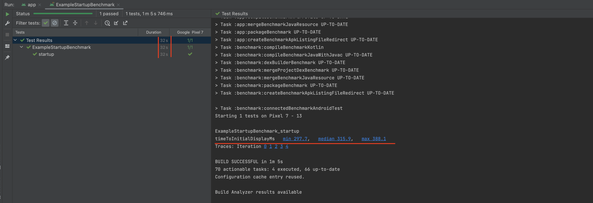

 

    
  </a>

  <h3 align="center">SliceUp - meal planning app</h3>

  

  Plan meals for the whole week. Save time, money, and energy for someone or something you love.

  
Table of Contents

  <ol>
    <li>
      <a href="#about-the-project">About The Project</a>
    </li>
    <li><a href="#roadmap">Roadmap</a></li>
    <li><a href="#roadmap">Screenshots</a></li>
    <li><a href="#room-database">Room Database</a></li>
    <li><a href="#room-database">Optimization</a></li>
    <li><a href="#mvvm">MVVM pattern</a></li>

  </ol>

## About The Project

SliceUp is my new Android app for planning meals for the whole week.
The main idea is to simplify the whole process of planning your meals - from creating a base with your favorite recipes, planning what you are going to cook for the whole week of just weekends, and finally, building an entire list of groceries to save time for shopping. 

### Built With

* Kotlin
* Jetpack compose

## Roadmap
- [x] Created personas, a customer journey map  <a href="https://drive.google.com/file/d/1vrpAytPPcbJLOrA0djycPZ3BcT5bxnfE/view?usp=sharing">Link</a>
- [x] Created the UX prototype - <a href="https://www.figma.com/file/CCxIlRWLMe1mUQ1WplVj29/MealPrep_current?node-id=1-632">Link to Figma</a>
- [x] Created UI on Jetpack compose
- [x] Integrated RoomDatabase to this project as a data persistence solution - <a href="https://github.com/eliseevavika/MealPrep/blob/main/app/src/main/java/com/example/mealprep/data/Database.kt">Link to Kotlin file</a>
- [x] Project optimization and Benchmark Metrics [See details below](#otimization)
- [x] MVVM pattern [See details below](#mvvm)
- [ ] Implementation of authorization and authentication

## Screenshots

  |    |  

  |    

## Room Database

Integrated RoomDatabase to this project as a data persistence solution. RoomDatabase is an Android library that provides an abstraction layer over SQLite, allowing for efficient and convenient database operations. 
By integrating RoomDatabase into my project, I was able to efficiently store, retrieve, and manage structured data, providing a robust and reliable data layer for my application.

Incorporating RoomDatabase into my project involved the following steps:

* Setting up the necessary dependencies: I added the Room library to my project's dependencies in the build.gradle file.
* Defining the entity classes: I created data classes that represent the tables in my database. These classes are annotated with @Entity to define their structure and properties.
* Creating the database class: I implemented a subclass of RoomDatabase that serves as the main access point to the database. This class is annotated with @Database and includes the entity classes and database version information.
* Defining DAO (Data Access Object) interface: I created an interface that defines the database operations using annotations such as @Insert, @Update, @Delete, and @Query. This interface serves as a bridge between the application and the database, allowing for convenient data access and manipulation.
* Accessing the database in the application: I utilized the RoomDatabase instance in my application's components, such as ViewModel or Repository class, to perform database operations asynchronously using coroutines or LiveData.

## Otimization

## Compose Optimization

To enhance the efficiency and responsiveness of my app's user interface, I made optimizations specifically targeting Jetpack Compose. By minimizing unnecessary recomposition, I ensured that only the relevant parts of the UI are updated when needed. This optimization significantly reduces the computational overhead, resulting in a more responsive and fluid user experience.

### Example 1

- **Problem:**
 
When I navigate to the "MealPrep" tab and select a specific day, such as Tuesday, a bottom sheet appears. From there, I have the option to add or edit my meal plan for that day. Once I'm in the meal plan interface, I can see a feed of all the available recipes and have the ability to select or unselect specific recipes.
When I click on a recipe, the rest of the feed is recomposed as well. 

- **How it should be:**

Only the alpha value of the selected image should be recomposed, while the rest of the feed should remain unchanged. 

-  **Solution:**

In this code below, we pass a callback function onPerformQuery from the parent composable (RecipesFeed) to the MenuDish composable. When the Card is clicked, we invoke the onPerformQuery callback and pass the recipe as an argument.
By using this callback mechanism, the recomposition will be limited to the specific MenuDish composable when the performQueryForChosenMeals function is called, instead of recomposing all the recipes in the LazyVerticalGrid.

   

   

### Example 2

- **Problem:**

When clicking on a specific day, the bottom sheet appears. Each time the bottom sheet is shown, the icon (for the row representing the day of the week) is recomposed unnecessarily.

- **How it should be:**

The icon should remain unaffected and not be recomposed when the bottom sheet is displayed.

-  **Solution:**

To avoid unnecessary recomposition of the icon, I have extracted it into a separate Composable function. By doing so, only the relevant parts of the code will be recomposed when needed.

   

 

## Benchmark Results
In order to improve the performance and user experience of my app, I implemented several optimizations and conducted benchmark measurements using the AndroidJUnit4 framework. 

### Startup Time Optimization

One of the key optimizations I focused on was reducing the startup time of the app. By benchmark results, I was able to measure the startup duration. Through careful analysis and optimization techniques, I was able to significantly improve the startup time from 32 seconds to 17 seconds.

### Metric
By conducting benchmark measurements, I tracked the progress of my optimizations and gained insights into the performance improvements. The timeToInitialDisplayMs metric, which measures the time it takes for the initial content to be displayed to the user, improved from 315.9 milliseconds to 221.9 milliseconds. These results demonstrate the positive impact of the optimizations I implemented.

 
 

## MVVM

In addition to performance optimizations, I also organized the project structure following the MVVM (Model-View-ViewModel) architectural pattern. I created additional folders and separated files according to their responsibilities, which improved code organization and maintainability. This architectural approach allowed for better separation of concerns and facilitated the development and testing processes.

## APACHE LICENSE, VERSION 2.0¶
Copyright 2023 Viktoriia Sidorova

Licensed under the Apache License, Version 2.0 (the "License");
you may not use this file except in compliance with the License.
You may obtain a copy of the License at

    http://www.apache.org/licenses/LICENSE-2.0

Unless required by applicable law or agreed to in writing, software
distributed under the License is distributed on an "AS IS" BASIS,
WITHOUT WARRANTIES OR CONDITIONS OF ANY KIND, either express or implied.
See the License for the specific language governing permissions and
limitations under the License.

