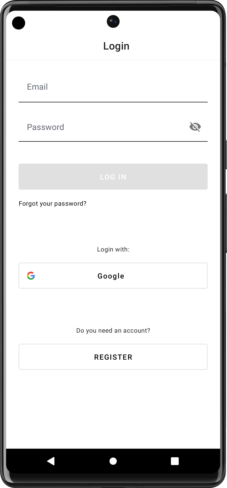

 

    
  </a>

  <h3 align="center">SliceUp - meal planning app</h3>

  

  Plan meals for the whole week. Save time, money, and energy for someone or something you love.

  
Table of Contents

  <ol>
    <li>
      <a href="#about-the-project">About The Project</a>
    </li>
    <li><a href="#roadmap">Roadmap</a></li>
    <li><a href="#screenshots">Screenshots</a></li>
    <li><a href="#room-database">Room Database</a></li>
    <li><a href="#optimization">Optimization</a></li>
    <li><a href="#mvvm">MVVM pattern</a></li>
     <li><a href="#authentication">Firebase Authentication</a></li>
     <li><a href="#export-import">Data export and import</a></li>
     <li><a href="#images">Saving images to Firebase Storage</a></li>
     <li><a href="#ingredient-count">Enhanced Ingredient Count Handling for Meal Planning</a></li>
  </ol>

## About The Project

SliceUp is my new Android app for planning meals for the whole week.
The main idea is to simplify the whole process of planning your meals - from creating a base with your favorite recipes, planning what you are going to cook for the whole week of just weekends, and finally, building an entire list of groceries to save time for shopping. 

### Built With

* Kotlin
* Jetpack compose

## Roadmap
- [x] Created personas, a customer journey map  <a href="https://drive.google.com/file/d/1vrpAytPPcbJLOrA0djycPZ3BcT5bxnfE/view?usp=sharing">Link</a>
- [x] Created the UX prototype - <a href="https://www.figma.com/file/CCxIlRWLMe1mUQ1WplVj29/MealPrep_current?node-id=1-632">Link to Figma</a>
- [x] Created UI on Jetpack compose
- [x] Integrated RoomDatabase to this project as a data persistence solution - <a href="https://github.com/eliseevavika/MealPrep/blob/main/app/src/main/java/com/example/mealprep/data/Database.kt">Link to Kotlin file</a>
- [x] Project optimization and Benchmark Metrics [See details below](#optimization)
- [x] MVVM pattern [See details below](#mvvm)
- [x] Implemented User authentication system (Firebase Authentication): login password authorization, password reset, sign-in with Google account, and sign-up functionality [See details below](#authentication)
- [x] Implemented data export and import, which allow users to seamlessly transfer their data between devices [See details below](#export-import)
- [x] Implemented functionality to save images to Firebase Storage [See details below](#images)
- [ ] Manual and Automated Testing 

## Screenshots

  |    |  

  |    

## Room Database

Integrated RoomDatabase to this project as a data persistence solution. RoomDatabase is an Android library that provides an abstraction layer over SQLite, allowing for efficient and convenient database operations. 
By integrating RoomDatabase into my project, I was able to efficiently store, retrieve, and manage structured data, providing a robust and reliable data layer for my application.

Incorporating RoomDatabase into my project involved the following steps:

* Setting up the necessary dependencies: I added the Room library to my project's dependencies in the build.gradle file.
* Defining the entity classes: I created data classes that represent the tables in my database. These classes are annotated with @Entity to define their structure and properties.
* Creating the database class: I implemented a subclass of RoomDatabase that serves as the main access point to the database. This class is annotated with @Database and includes the entity classes and database version information.
* Defining DAO (Data Access Object) interface: I created an interface that defines the database operations using annotations such as @Insert, @Update, @Delete, and @Query. This interface serves as a bridge between the application and the database, allowing for convenient data access and manipulation.
* Accessing the database in the application: I utilized the RoomDatabase instance in my application's components, such as ViewModel or Repository class, to perform database operations asynchronously using coroutines or LiveData.

## Optimization

## Compose Optimization

To enhance the efficiency and responsiveness of my app's user interface, I made optimizations specifically targeting Jetpack Compose. By minimizing unnecessary recomposition, I ensured that only the relevant parts of the UI are updated when needed. This optimization significantly reduces the computational overhead, resulting in a more responsive and fluid user experience.

### Example 1

- **Problem:**
 
When I navigate to the "MealPrep" tab and select a specific day, such as Tuesday, a bottom sheet appears. From there, I have the option to add or edit my meal plan for that day. Once I'm in the meal plan interface, I can see a feed of all the available recipes and have the ability to select or unselect specific recipes.
When I click on a recipe, the rest of the feed is recomposed as well. 

- **How it should be:**

Only the alpha value of the selected image should be recomposed, while the rest of the feed should remain unchanged. 

-  **Solution:**

In this code below, I pass a callback function onPerformQuery from the parent composable (RecipesFeed) to the MenuDish composable. When the Card is clicked, I invoke the onPerformQuery callback and pass the recipe as an argument.
By using this callback mechanism, the recomposition will be limited to the specific MenuDish composable when the performQueryForChosenMeals function is called, instead of recomposing all the recipes in the LazyVerticalGrid.

   

   

### Example 2

- **Problem:**

When clicking on a specific day, the bottom sheet appears. Each time the bottom sheet is shown, the icon (for the row representing the day of the week) is recomposed unnecessarily.

- **How it should be:**

The icon should remain unaffected and not be recomposed when the bottom sheet is displayed.

-  **Solution:**

To avoid unnecessary recomposition of the icon, I have extracted it into a separate Composable function. By doing so, only the relevant parts of the code will be recomposed when needed.

   

 

## Benchmark Results
In order to improve the performance and user experience of my app, I implemented several optimizations and conducted benchmark measurements using the AndroidJUnit4 framework. 

### Startup Time Optimization

One of the key optimizations I focused on was reducing the startup time of the app. By benchmark results, I was able to measure the startup duration. Through careful analysis and optimization techniques, I was able to significantly improve the startup time from 32 seconds to 17 seconds.

### Metric
By conducting benchmark measurements, I tracked the progress of my optimizations and gained insights into the performance improvements. The timeToInitialDisplayMs metric, which measures the time it takes for the initial content to be displayed to the user, improved from 315.9 milliseconds to 221.9 milliseconds. These results demonstrate the positive impact of the optimizations I implemented.

 
 

## MVVM

In addition to performance optimizations, I also organized the project structure following the MVVM (Model-View-ViewModel) architectural pattern. I created additional folders and separated files according to their responsibilities, which improved code organization and maintainability. This architectural approach allowed for better separation of concerns and facilitated the development and testing processes.

## Authentication

In my app, I implemented a comprehensive user authentication system that includes login password authorization, password reset, sign-in with Google account, and sign-up functionality. This was achieved using Firebase Authentication, a powerful and secure authentication service provided by Firebase.

With login password authorization, users can securely log into their accounts using their registered email and password. In case users forget their password, the app also offers a password reset feature, allowing them to easily regain access to their accounts.

To enhance the sign-in experience and provide users with more options, I integrated Google Sign-In functionality. This enables users to sign in to the app using their Google accounts, eliminating the need to create a new account.

For new users, the app provides a seamless sign-up process, allowing them to create an account with their email and password. This functionality is securely managed by Firebase Authentication, ensuring that user data remains protected.

By leveraging the power and reliability of Firebase Authentication, I created a robust and user-friendly authentication system that enhances the security and convenience of the app. Users can confidently access the app's features and services, knowing that their accounts are well-protected.

Overall, the integration of Firebase Authentication and the implementation of various authentication features have greatly improved the user experience and security of my app's login and sign-up functionalities.

## Export Import
**Problem:**

In SliceUp, I encountered an issue with the local Room database, which serves as the primary storage for all user data in the app. When a user decided to download the app on a new phone or switch devices, there was no data available in their account.

**Solution:**

To address this problem, I implemented two essential functionalities: data export and import. These features enable users to seamlessly transfer their data between devices.

**Data Export:**

I implemented the data export functionality, which allows users to create a JSON file containing all their recipes, ingredients, meal plans, and steps. This file is saved locally on the device and can be shared with other apps.

**Data Import:**

The data import functionality complements data export by enabling users to import their previously exported JSON file. Once the file is selected, all the data it contains is parsed and inserted into the local Room database on the new device. As a result, users can have all their data restored in the app on the new phone, ensuring a seamless continuation of their SliceUp experience.

## Images
## Firebase Storage

**Problem 1:**

Previously, in SliceUp, I was saving recipe images to the FileProvider, which caused issues when users changed phones and tried to import their data. The images were not available on the new phone, leading to a subpar user experience.

**Solution 1:**

To address this problem, I decided to introduce functionality to save images to Firebase Storage. When a user creates a new recipe with a photo, I save the image to Firebase Storage and obtain the download URL.

**Problem 2:**

After implementing the solution of saving images to Firebase Storage, a new issue emerged. When a user creates a recipe with an image and presses the "Save Recipe" button, there is a noticeable delay of up to 7 seconds before the newly created recipe appears on the screen. This delay is caused by the process of saving the image to Firebase Storage and waiting for the downloaded URL.

**Solution 2:**

To optimize the user experience and eliminate the delay, I devised a new approach. Now, when a user creates a recipe with an image, I first save the image to the FileProvider, and the path to the image is saved in the local Room database. This ensures that the user can see the newly created recipe right away without any waiting.

In the background, I asynchronously save the image to Firebase Storage and obtain the downloaded URL. Once the URL is available, I update the photo field of the corresponding recipe in the local Room database. This seamless and asynchronous process guarantees that the images are properly linked to the recipes, and users can enjoy a smooth and uninterrupted experience when creating and viewing recipes.

## Ingredient Count

**Problem:**

When I add the same recipe to different days of the week, the grocery shopping list generated from the weekly recipe planning only shows each ingredient once. This becomes problematic when I want to cook the same recipe multiple times within a week because it doesn't accurately reflect the total ingredients needed.

**Solution:**

To address this issue, I implemented a solution where I created a new data class (IngredientWithCount) that aggregates ingredient counts across different meal planning instances of the same recipe. This new data class is used to display ingredient counts accurately in the UI, reflecting the total ingredients required based on how many times a recipe is included in the meal plans for the week.

### APACHE LICENSE, VERSION 2.0¶

Copyright 2023 Viktoriia Sidorova

Licensed under the Apache License, Version 2.0 (the "License");
you may not use this file except in compliance with the License.
You may obtain a copy of the License at

    http://www.apache.org/licenses/LICENSE-2.0

Unless required by applicable law or agreed to in writing, software
distributed under the License is distributed on an "AS IS" BASIS,
WITHOUT WARRANTIES OR CONDITIONS OF ANY KIND, either express or implied.
See the License for the specific language governing permissions and
limitations under the License.

